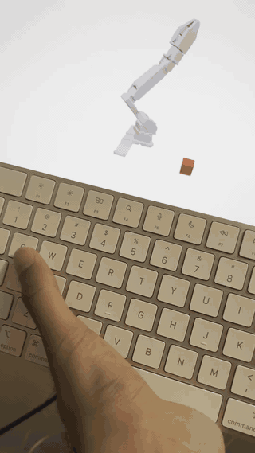
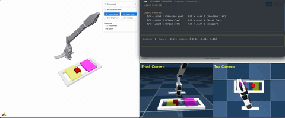

# LeRobot Simulator + Data Collection System

> Collect high-quality robot manipulation demonstrations in simulation! A complete data collection system for the SO-100 robotic manipulator. Features Viser-powered web visualization, multiple teleoperation modalities, storage, and replay capabilities. For robot learning research, behavior cloning, and human-in-the-loop data collection.


## Features
- **Gymnasium Environment** - Gymnasium environment for LeRobot SO-100 robot (credits to [gym-lowcostrobot](https://github.com/perezjln/gym-lowcostrobot)).
- **Multiple Control Methods** - Keyboard, game controller, or watch mode  
- **Automatic Data Recording** - Every action saved to compressed format (including joint positions, actions, rewards, timestamps, and camera images)
- **Replay System** - Review and replay collected demonstrations  
- **Web Visualization** - Real-time 3D view via [Viser](https://viser.studio/main/)!!  
- **6 Manipulation Tasks** - Lift, reach, push, pick-place, stack  

<table>
<tr>
<td width="50%">
<h3 align="center">Keyboard Control</h3>



</td>
<td width="50%">
<h3 align="center">Game Controller</h3>


</td>
</tr>
<caption><b>Control Methods Demo (pardon my video capturing skills lol)</b></caption>
</table>


<h3 align="center">Camera Views</h3>
<p align="center">
  
</p>


## Quick Start

### Installation
```bash
pip install -e . # preferably use uv :) 
```

### Collect Data
```bash
python collect_data.py
```

1. Choose environment (6 tasks)
2. Choose control method (keyboard/controller/replay/watch)
3. Start collecting!
4. Data auto-saves to `collected_data/` on exit


### View Visualization
Open http://localhost:8080 in your browser

## Data Collection

### What Gets Recorded

Every step captures:
- Joint positions (observations)
- Joint commands (actions)
- Task rewards
- Timestamps
- Camera images (Front + Top views, 240x320x3 RGB)

### Storage Format
- Filename: `{env}_{method}_{timestamp}.npz`

### Example Output
```
collected_data/
├── LiftCube-v0_controller_20251031_143022.npz
├── ReachCube-v0_keyboard_20251031_144501.npz
└── StackTwoCubes-v0_controller_20251031_150330.npz
```

## Replay System

When you run `collect_data.py`, if recordings exist:
- Option **3** appears: "📼 Replay Recording"
- Shows table of all recordings with dates, episodes, steps
- Select any recording to replay in simulation


## Architecture

```
gym-lowcostrobot/
├── collect_data.py                 # Entry point 
├── collected_data/                 # Auto-saved recordings
└── data_collection/                # Main package
    ├── config.py                   # Constants
    ├── main.py                     # Orchestration
    ├── ui/                         # User interface
    │   ├── menus.py               # Interactive menus
    │   └── display.py             # Status displays
    ├── controllers/                # Control logic
    │   ├── base.py                # Abstract base
    │   ├── keyboard.py            # Keyboard control
    │   ├── gamepad.py             # Game controller
    │   └── watch.py               # Random actions
    ├── recording/                  # Data recording
    │   └── recorder.py            # DataRecorder class
    └── replay/                     # Playback system
        ├── loader.py              # Load recordings
        └── player.py              # ReplayController
```

## Environments

| Environment | Task |
|------------|------|
| **LiftCube-v0** | Lift cube above threshold |
| **ReachCube-v0** | Reach end-effector to cube |
| **PushCube-v0** | Push cube to target |
| **PushCubeLoop-v0** | Push between two regions |
| **PickPlaceCube-v0** | Pick and place at target |
| **StackTwoCubes-v0** | Stack blue on red |

## Controls

### Keyboard
```
Q/A → Joint 1    W/S → Joint 2    E/D → Joint 3
R/F → Joint 4    T/G → Joint 5    Y/H → Joint 6
SPACE = Reset    ESC = Exit
```

### Game Controller
```
Left Stick  → Joints 1 & 2
Right Stick → Joints 3 & 4
ZL/ZR       → Gripper
Plus        → Reset
Minus       → Exit
```

## Data Format

Each `.npz` file contains:
```
{
    "env_name": str,
    "control_method": str,
    "num_episodes": int,
    "episode_0_observations": ndarray,     # (steps, 6) joint positions
    "episode_0_actions": ndarray,          # (steps, 6) joint commands
    "episode_0_rewards": ndarray,          # (steps,) rewards
    "episode_0_timestamps": ndarray,       # (steps,) timestamps
    "episode_0_images_front": ndarray,     # (steps, 240, 320, 3) RGB images
    "episode_0_images_top": ndarray,       # (steps, 240, 320, 3) RGB images
    ...
}
```
## Requirements

- Python 3.8+
- gymnasium >= 0.29
- mujoco >= 3.0
- viser >= 1.0.0
- rich >= 13.0.0
- scipy >= 1.0.0
- trimesh >= 3.0.0
- pynput >= 1.7.0 (keyboard)
- pygame >= 2.0.0 (gamepad)

> ⚠️ **BETA PREVIEW**
> the repository is in active development. Expect **breaking changes** and **missing features** during the beta phase. 
> contributions welcome!

## License
The repository is licensed under the Apache License, Version 2.0

## Acknowledgments
This work wouldn't exist without the excellent work of the [HuggingFace LeRobot](https://github.com/huggingface/lerobot) team, [MuJoCo](https://github.com/google-deepmind/mujoco) and [Viser](https://github.com/nerfstudio-project/viser). 


